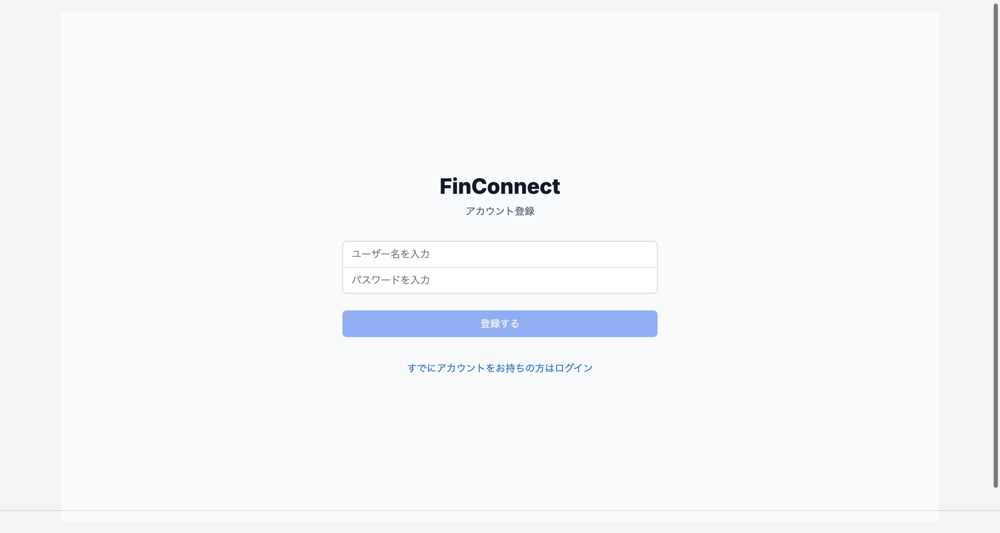

# FinConnect

## プロジェクト概要
金融系SNSアプリケーションのバックエンド開発プロジェクトです。ユーザー同士が金融に関する情報を共有し、コミュニケーションを取ることができるプラットフォームを目指しています。
## 主な機能と画面

### 1. ユーザー認証
<div align="center">



</div>

- ユーザー登録・ログイン機能
- セキュアな認証システム(JWT、BCrypt)

### 2. 投稿機能
<div align="center">


</div>

- 投稿
- いいね機能
- コメント機能

### 3. プロフィール管理
<div align="center">


</div>

- プロフィール情報の表示
- プロフィール編集
- フォロワー/フォロー中の表示

### 4. ユーザー検索とフォロー
<div align="center">

</div>

- ユーザー検索機能
- フォロー/フォロー解除

### 5. モバイル対応
<div align="center">

</div>

- スマートフォンに最適化された表示
- モバイルフレンドリーなUI

### 6. ホーム画面
<div align="center">

</div>

- 今後API実装予定


### 開発予定の機能
- 金融関連ダッシュボード
- 経済ニュースフィード
- 独自の本人認証システム
- リアルタイムチャット機能
- イベント管理システム

## 使用技術

### バックエンド
- **メイン言語・フレームワーク**
  - Java
  - Spring Boot 3.4.1
  
- **データベース**
  - PostgreSQL
  - JPA/Hibernate

- **セキュリティ**
  - Spring Security
  - JWT（JSON Web Token）
  - BCrypt暗号化

### 開発ツール
- Postman（API テスト）
- Git（バージョン管理）

## システム構成図
```
src/
├── main/
│ ├── java/
│ │ └── com.finconnect/
│ │ ├── config/ # 設定ファイル
│ │ ├── controller/ # APIエンドポイント
│ │ ├── model/ # エンティティ
│ │ ├── repository/ # データアクセス
│ │ └── service/ # ビジネスロジック
└─└─── resources/
```

## 主要API一覧

### 認証関連
- `POST /api/v1/auth/signup` - 会員登録
- `POST /api/v1/auth/login` - ログイン

### ユーザー関連
- `GET /api/v1/users` - ユーザー検索
- `GET /api/v1/users/{username}` - ユーザー情報取得
- `PATCH /api/v1/users/{username}` - ユーザー情報更新

### 投稿関連
- `GET /api/v1/posts` - 投稿一覧取得
- `POST /api/v1/posts` - 投稿作成
- `PATCH /api/v1/posts/{postId}` - 投稿更新
- `DELETE /api/v1/posts/{postId}` - 投稿削除

### 返信関連
- `GET /api/v1/posts/{postId}/replies` - 返信一覧取得
- `POST /api/v1/posts/{postId}/replies` - 返信作成
- `PATCH /api/v1/posts/{postId}/replies/{replyId}` - 返信更新
- `DELETE /api/v1/posts/{postId}/replies/{replyId}` - 返信削除

### ソーシャル機能
- `POST /api/v1/users/{username}/follow` - フォロー
- `DELETE /api/v1/users/{username}/follow` - フォロー解除
- `GET /api/v1/users/{username}/followers` - フォロワー一覧
- `GET /api/v1/users/{username}/following` - フォロー中一覧

### いいね機能
- `POST /api/v1/posts/{postId}/like` - いいね切り替え
- `GET /api/v1/posts/{postId}/likes` - いいねユーザー一覧

### 認証
すべてのAPI（認証系を除く）は、以下の形式でJWTトークンが必要：
Authorization: Bearer {access_token}

### エラーレスポンス
- 400: Bad Request
- 401: Unauthorized 
- 403: Forbidden
- 404: Not Found
- 500: Internal Server Error

## 開発者
Seonho AN 
